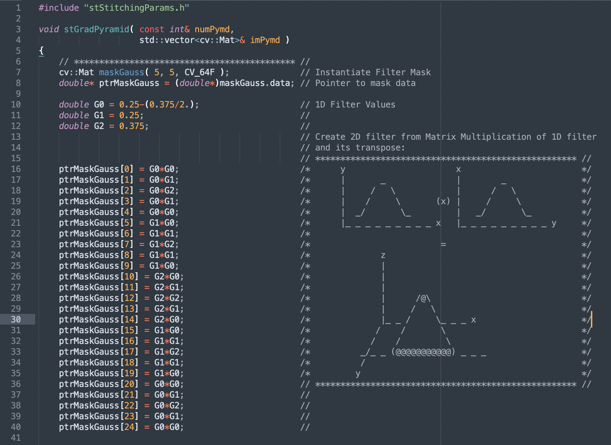

# C++ Prototype Implementation

<!-- MarkdownTOC -->

- [C++ Version](#c-version)
- [Code Styling](#code-styling)
- [Entrypoint\(s\)](#entrypoints)
- [References](#references)

<!-- /MarkdownTOC -->

## C++ Version

This code was originally developed in the Summer of 2010 and then partially refactored for testing and validation purposes in the Fall of 2010.

This code depends on `C++03` and an early version of [`OpenCV v2.1`](https://sourceforge.net/projects/opencvlibrary/files/opencv-win/2.1/) from April 2010.

## Code Styling

This code was developed on Windows XP using Tabs (`\t`) instead of Spaces and is formatted best at `4` spaces per tab.

## Entrypoint(s)

The `RUN_TEST.cpp` file contains the entrypoint `int main()` function with hardcoded paths to two images (or video frames).

The code was originally developed on Windows XP with Microsoft Visual Studio using `C++03`.

## References

- [`OpenCV v2.1` Library](https://sourceforge.net/projects/opencvlibrary/files/opencv-win/2.1/)
- [`OpenCV v2.1` Documentation](http://opencv.jp/opencv-2.1_org/c/index.html)
- [`C++03` Reference Documentation](https://en.cppreference.com/w/)
